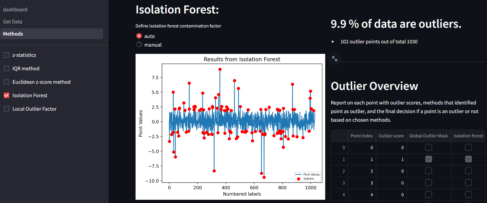
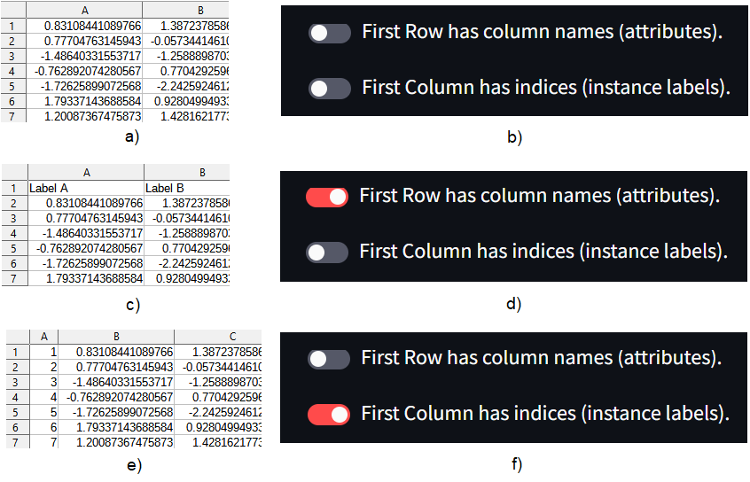

# Outliers Lab

###### Click **[here](https://outlierslab.streamlit.app)** to run the tool from your browser.



### Short Description:

A tool focused on outlier detection, based on various Statistical and Machine Learning methods. 

##### User can:

- Upload data (of any dimension), or use demo-data provided.
- Use various methods (and tune them) to identify outliers.
- Interact with each method parameters and identify best parameters based on visualizations.
- Combine different methods to identify outliers.
- Save various files:
    - the clean data 
    - visualizations for various methods used
    - outlier report.

*Note: For data with dimensions more than 2d, visualizations are shown on 2d based on dimensionality reduction methods. This is representative of the data, but some information is unavoidably lost.* 

### Methods Available:

- **Statistical methods**:
    - z-score (currently available for 1d-data).
    - modified z-score (currently available for 1d-data).
    - Interquartile Range method (currently available for 1d-data).
    - Euclidean distance z-score method (from mean)

- **ML methods**:
    (Could also be named advanced statistical methods...)
    - Isolation forest (any-dimension data).
    - Local Outlier Factor (any-dimension data).


### Checklist for uploaded data:

- [ ] File format: **.csv** or **.xlsx** .
- [ ] File size: **smaller than 200Mb**.
- [ ] Data in **tabular form**. 
      Columns : features, 
      Rows : data instances
- [ ] Data should **not have missing data**.
- [ ] ***Data to be analyzed*** (read next paragraph) are **numeric**.


Data can also include indices and/or column names. If they do, then when uploaded, user should choose accordingly from the options that appear, like the following figure. For data structures like a, c or e, user should choose options b, d or f accordingly. ***Data to be analyzed*** depend on the choices from the user.




### Built with:

[![Python][Python.js]][Python-url] 
[![Scikit-learn][Scikit-learn.js]][Scikit-learn-url] [![Scipy][Scipy.js]][Scipy-url] 
[![Numpy][Numpy.js]][Numpy-url] [![Pandas][Pandas.js]][Pandas-url] 
[![Matplotlib][Matplotlib.js]][Matplotlib-url] [![Seaborn][Seaborn.js]][Seaborn-url] 
[![Streamlit][Streamlit.js]][Streamlit-url]
[![Git][Git.js]][Git-url]


### Output:
    
You can save the following files:
    1) Outlier Report with multiple sheets in .xlsx format.
    2) Clean Data in a .csv format
    3) Predicted outliers from chosen methods (True->Outlier) in a .csv format.
    4) Plots for each method with identified outliers marked.
    3) Plot of clean Vs Raw data (as .png)


### Install locally

Follow these steps from a command line:

1. Navigate to the folder that the tool will be installed.

2. Get repository from github:
    ```
    git clone https://github.com/SavvasEft/outliers_lab.git
    ```

3. Create a virtual environment to isolate packages that will be installed:
    ```
    python -m venv venv
    ```

4. Activate virtual environment:
    In same folder you downloaded file:
    ```
    venv/Scripts/activate
    ```

5. Install outliers lab:
    ```
    pip install -r requirements.txt
    ```

6. Run tool locally: 
    ```
    streamlit run dashboard.py
    ```

7. Deactivate virtual environment:
    ```
    deactivate
    ```


[](/LICENSE)


<!-- CONTACT -->
## Contact

[![LinkedIn][linkedin-shield]][linkedin-url]


<p align="right">(<a href="#readme-top">back to top</a>)</p>


[Python.js]: https://img.shields.io/badge/python-3670A0?style=for-the-badge&logo=python&logoColor=ffdd54
[Pandas.js]: https://img.shields.io/badge/pandas-%23150458.svg?style=for-the-badge&logo=pandas&logoColor=white
[Numpy.js]: https://img.shields.io/badge/numpy-%23013243.svg?style=for-the-badge&logo=numpy&logoColor=white
[Streamlit.js]: https://img.shields.io/badge/streamlit-FF4B4B?style=for-the-badge&logo=streamlit&logoColor=white
[Matplotlib.js]: https://img.shields.io/badge/matplotlib-%23013243?style=for-the-badge&logo=Matplotlib&logoColor=black
[Scipy.js]: https://img.shields.io/badge/SciPy-%230C55A5.svg?style=for-the-badge&logo=scipy&logoColor=%white
[Git.js]: https://img.shields.io/badge/git-%23F05033.svg?style=for-the-badge&logo=git&logoColor=white
[Scikit-learn.js]: https://img.shields.io/badge/scikit--learn-%23F7931E.svg?style=for-the-badge&logo=scikit-learn&logoColor=white
[Seaborn.js]: https://img.shields.io/badge/seaborn-%23F7931E.svg?style=for-the-badge&logo=seaborn&logoColor=white

[Python-url]: https://www.python.org/
[Pandas-url]: https://pandas.pydata.org/
[Numpy-url]: https://numpy.org/
[Streamlit-url]: https://streamlit.io/
[Matplotlib-url]: https://matplotlib.org/
[Scipy-url]: https://scipy.org/
[Git-url]: https://git-scm.com/
[Scikit-learn-url]: https://scikit-learn.org/
[Scikit-learn-url]: https://scikit-learn.org/
[Seaborn-url]: https://seaborn.pydata.org/


[linkedin-shield]: https://img.shields.io/badge/-LinkedIn-black.svg?style=for-the-badge&logo=linkedin&colorB=555
[linkedin-url]: https://www.linkedin.com/in/savvas-eftychis/
